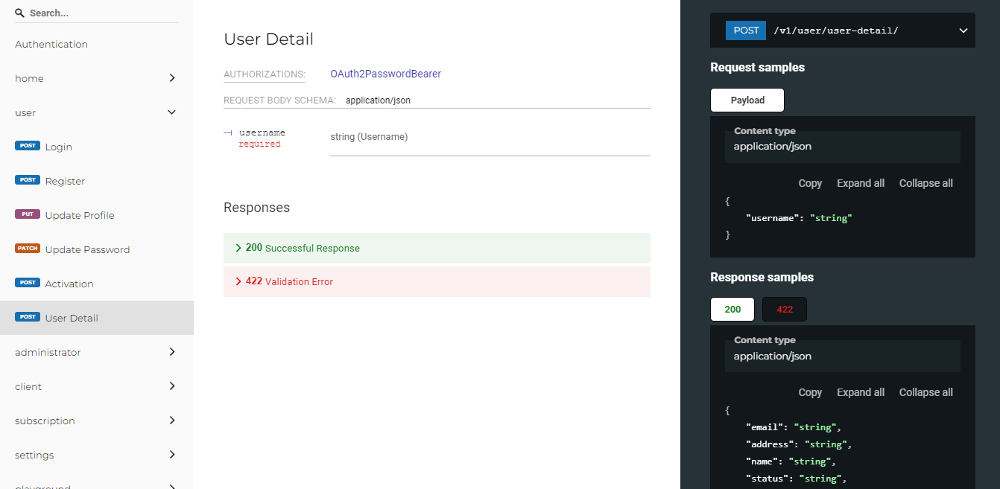

# gajiku-backend
Rest API (backend) Gajiku

# Virtual environment
It is recommended to use virtual environment in the project, in order to create an isolated environment for Python projects. This means that each project can have its own dependencies, regardless of what dependencies every other project has.

I am using virtualenv https://virtualenv.pypa.io/

# Install all libraries
pip install -r requirements.txt

# Alembic database migration
alembic upgrade head

# Run API
fastapi run 
http://127.0.0.1:8000/  
http://127.0.0.1:8000/docs  
http://127.0.0.1:8000/redoc

